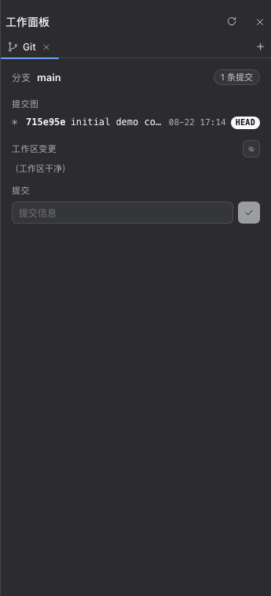
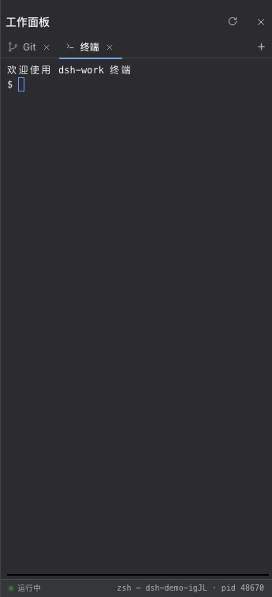

# dsh-work

为 DeepSeek Harness Web GUI 增加右侧停靠的「工作面板」：多实例标签页架构，支持目录
树、Git、浏览器（含 Eruda 调试面板）、多终端（node-pty + xterm.js，WebSocket 双向流）
等功能，每个功能可同时运行多个实例，新功能通过注册机制即插即用。





- **面板**：右侧停靠（`shell.overlay` 插槽，id: workbench），可收起为右侧边缘按钮；
  工作目录固定跟随当前会话 cwd（不再提供手动路径输入）。**宽度可拖拽调整**：拖动
  面板左边缘改变整体宽度（最小 280px，最大 = 框架宽度 − 左侧栏宽度，即面板最宽盖满
  对话区但绝不遮挡左侧栏；跟随窗口缩放与 sidebar 折叠/展开自动重算）。**收起为两段式**：
  单击左缘手柄（或头部收起按钮）——面板宽于最窄时先动画收窄到 280px，已最窄时再
  单击才滑出并收起；双击手柄重置为默认 344px。**所有宽度变更（打开滑入/收窄/收起/
  双击重置/窄面板选文件自动加宽）统一走 300ms 逐帧动画，曲线与主框架左侧栏收起一致**
  （`--ds-ease-in-out`：cubic-bezier(0.4,0,0.2,1)，拖拽期间不动画）；单击**即时响应、
  零延迟**（原 300ms 为单击/双击判定延迟，已改为单击立即执行、双击取消并重置）；
  宽度持久化到 localStorage，刷新后保持（收起后重开回到最窄宽度）；系统开启「减弱
  动态效果」（`prefers-reduced-motion`）时全部动画跳过、瞬时到位。
- **三列联动**：面板展开时，面板宽度会实时映射到中间对话列的 `margin-right`——
  拖宽面板，对话区同步变窄，形成「侧栏 | 对话 | 工作面板」互相影响宽度的三列布局；
  面板收窄/收起/双击重置时对话区同步回宽。对话区有 480px 保底宽度（面板超过该上限
  时退化为覆盖式，与旧行为一致）；框架自带 details 列打开时联动暂停（原生细节列
  接管右缘，避免双挤压）。纯 DOM 观察实现，不触碰框架布局源码。
- **目录 tab**：文件/目录树（目录可展开收起，文件行显示大小）。**点击文件在面板内
  预览内容**——文本/代码文件在「源码」视图可编辑（超 1MB 只读截断提示），图片内嵌
  显示，音频/视频用浏览器播放器播放，未知二进制显示名称 + 大小 + 无法预览提示。
  预览为**两栏常驻模式**：点击任意文件，面板即左右一分为二——左侧目录树保留、
  右侧详情区即时切换文件内容，中间分隔条可**自由拖动**调整目录/详情比例（树宽区间
  [120, 面板宽 − 240]，内容区保底 240px；比例持久化）。面板宽度不再设分栏门槛：
  窄面板由树自动让位、内容区保持可用；面板较窄时点击文件自动加宽到 720px 再分栏。
- **代码样式**：文本预览带内置语法高亮（无依赖 tokenizer，覆盖 ts/js/json/yaml/
  py/go/rust/java/cpp/cs/php/ruby/swift/kotlin/shell/sql/css/html/markdown 等；
  颜色走壳的 `--shiki-token-*` 全局调色板，与代码块一致）。无扩展名的常见文本
  文件（Makefile / Dockerfile / LICENSE 等）按「未知类型」处理，显示名称 + 大小
  + 无法预览提示（不在文本预览范围）；已知文本扩展名但不在高亮语言表里的
  回退纯文本，超 300KB 跳过 token 以保流畅。
- **MD 解释器**：`.md`/`.markdown`/`.mdx` 文件打开即渲染——基于第三方解析器
  **marked v18**（MIT，内联于插件，无外部请求）：完整 GFM（**表格**/任务列表/
  删除线/自动链接）+ 标题/段落/代码围栏（走内置高亮）/列表/引用/分隔线/行内样式，
  预览头可切回「源码」。原始 HTML 一律按纯文本转义（文件内容不可信，任何标签
  不进 DOM）；链接只放行 http(s)/mailto；图片允许 http(s) 直连与同树相对路径
  （走 `/workbench/asset` 路由，父目录 `..` 拒绝）。
- **HTML 浏览器**：`.html`/`.htm` 文件打开即在内置浏览器预览——沙箱 iframe
  （`sandbox="allow-scripts"`，无同源权限，脚本无法触碰面板或应用），相对
  `src`/`href`（同目录与子目录）自动重写到 `/workbench/asset` 路由，同树
  css/js/图片可加载；http(s)/根路径/锚点/父目录路径不动。预览头可切回「源码」。
- **代码编辑器**：文本文件（js/ts/css/html/md 等）的「源码」视图是内嵌
  **CodeMirror 6** 编辑器（BSD 协议，esbuild 打包内联，惰性加载）：行号、
  语法高亮（颜色走壳的 `--shiki-token-*` 调色板）、撤销/重做、括号匹配、
  Tab 缩进。md/html 文件在「源码 | 预览」之间切换，切到预览再切回编辑内容
  不丢失。**保存**（`POST /workbench/write`，原子写：临时文件 + rename，
  仅限已存在文件，内容 ≤ 1MB，`..` 段拒绝）成功后预览立即刷新；文件超过
  1MB 只读预览、禁用编辑。头部另提供**在 VS Code 中打开**（`POST
  /workbench/open`，优先 `code -r` 复用窗口，回退系统默认编辑器）。
- **Git tab**：分支、提交图（HEAD 标记）、工作区变更（暂存/取消暂存/全部暂存/
  忽略/取消忽略）、提交框与一键 init（非仓库时）。
- **浏览器 tab**：沙箱浏览器——URL 栏输入网址（自动补全 https），服务端抓取 HTML、
  注入 `<base>` 让资源从源站加载、把所有 `<a href>` 重写回代理保持导航受控，以
  `sandbox="allow-scripts allow-forms allow-popups"` 的 iframe 渲染（脚本跑在
  不透明源里，无法碰面板或父页面）；支持后退/前进/刷新导航历史；非 HTML 内容类型
  拒绝并提示（图片/PDF/纯文本等请使用「目录」预览）；**内置 Eruda 调试面板**
  （Console / Elements / Network / Resources / Sources / Info），接近 Chrome DevTools
  体验，页面加载后右下角出现浮球，点击展开面板。
- **终端 tab**：真 PTY 交互式终端——宿主半用 **node-pty** 起登录 shell（`$SHELL`，
  缺省 zsh/bash；TERM=xterm-256color），客户端半内嵌 **xterm.js v6**（esbuild 内联，
  含 fit addon），经 `/workbench/terminal/ws` WebSocket 双向流收发。**多终端同时运行**：
  「+」→ 终端可开任意多个标签（标签自动编号「终端 / 终端 2 / …」），每个标签是独立
  PTY 会话，进程在宿主常驻——所有标签常驻挂载，切换标签只切显隐，后台终端继续跑、
  滚动回看不丢。工作目录跟随当前会话 cwd；面板拖宽/窗口缩放
  自动 fit 并同步 PTY 尺寸。**连接韧性**：断线指数退避自动重连；宿主为每个会话保留
  最近 ~256KB 输出环形缓冲，切回/重连/刷新后回放近期内容；页面刷新在 60s 孤儿宽限内
  重连同会话（标签名经 localStorage 恢复）。进程退出/会话消失显示覆盖层，一键重新
  启动；关闭标签即杀对应会话（SIGTERM→SIGKILL 升级）。**安全**：shell 固定为用户
  登录 shell（不接受任意命令）；子进程 env 剔除凭据形（KEY/PASSWORD/SECRET/TOKEN）
  与 DSH_* 变量；WS 升级拒绝异源 Origin（防跨站 WebSocket 劫持）；会话上限 8 个。
- **任务看板 tab**：五列看板（待规划 / 待办 / 进行中 / 已完成 / 已失败）+ 搜索 +
  归档视图。任务可钉住工作区、agent 预设与权限预设（read-only / workspace-write /
  danger-full-access）。点「执行」由 **Host 新建独立 DSH 会话**真实执行任务 Prompt，
  会话 `turn/end` 后状态自动回写（成功→已完成、错误→已失败），执行记录可一键跳回
  执行会话复盘。**Host cron 定时**：5 段 cron（分 时 日 月 周，Host 本地时区，支持
  `*`/`*/n`/范围/逗号列表、周日 0/7、标准日/周 OR 语义），**关闭浏览器后 Host 仍到点
  执行并结算**；错过的触发点（Host 停止/睡眠）跳过不补跑；同一任务运行中不并发。
  任务/计划/执行记录存 **Host 权威账本**（`$DSH_HOME/dsh-work/taskboard-ledger.json`，
  原子写 + revision + 最近 256 条请求指纹幂等 + 目录锁），浏览器只是异步视图：动作
  只有经 Host 确认才成为 UI 状态；刷新/重启后数据仍在；损坏账本改名隔离不覆盖；
  重启对账——已有会话 id 的运行中执行继续观察，没有会话 id 的启动中断取消不重发。
  打开看板标签时面板自动加宽到 60% 视口（可再拖）。执行消耗与普通 DSH 会话相同的
  API 额度。核心逻辑（cron/状态机/账本/运行器/UI 结构）移植自
  [dsh-web-ui](https://github.com/zhu1090093659/dsh-web-ui) 的 `packages/dsh-task-board`
  （Apache-2.0，署名见 NOTICE）；移植裁剪：去掉空闲睡眠保护、v1 迁移导入、受信反代
  token 与 SSE（改 5s 轮询 + 动作后即时刷新）。

预览与编辑的宿主路由见下方结构；**改源码后先 `pnpm build`** 再生效：宿主半改动需重启
dsh web（路由在进程启动时注册），客户端半改动刷新页面即可。

## 结构

源码按功能拆分在 `src/`，构建产物在 `lib/`（esbuild，`pnpm build` 生成）：

```
src/index.js    宿主半入口：name/inject/apply + 路由装配，re-export 纯函数
src/routes.js   路由装配层：把 /workbench/* 各功能路由注册到 webServer 并聚合卸载
src/routes/     路由按功能拆分的模块（shared 响应 helper / git / files / browser / terminal）
src/git.js      git 事实采集与操作（runGit / inspect / init / ignore / …）
src/files.js    目录/文件操作与分类（listDir / filePreview / writeFileAtomic / …）
src/browser.js  浏览器沙箱代理（URL 抓取 + HTML 链接重写 + 内容类型校验 + Eruda 调试面板注入）
src/terminal.js 终端会话管理（node-pty 惰性加载 / 环形输出缓冲 / 孤儿回收 / env 剔除）
src/validate.js 入参校验与请求体读取
src/taskboard/  任务看板宿主半（移植自 dsh-web-ui/dsh-task-board，Apache-2.0）
  schedule.js    5 段 cron 解析与下次触发（纯函数）
  domain.js      任务状态机与用例（create/update/delete/archive/schedule/settle）
  ledger.js      Host 权威账本（原子持久化 / 幂等 / 目录锁 / 损坏隔离 / 重启对账）
  runner.js      真实 DSH 会话执行与 turn/end 结算观察
  service.js     服务编排（30s cron tick / 5s 会话轮询 / 动作入口）
  protocol.js    动作信封严格判别联合校验
  routes.js      /workbench/taskboard/{state,action,options} 路由
  parse.js / dsh-home.js  账本解析修复 / DSH_HOME 解析
src/client/     客户端半源码（按功能拆分）
  index.js       入口：shell.overlay 注册（id: workbench）+ apply + 样式注入
  features.js    功能注册表（id/label/icon/组件/单实例/可关闭）
   panel.js       WorkbenchPanel 组装与渲染 + 三列联动（installDockCoupling）
   panel-geometry.js  面板几何 hook（宽度/展开/动画/拖拽/自动加宽/持久化）
   panel-tabs.js      标签系统 hook（打开/关闭/改名/终端恢复与持久化）
   panel-git.js       Git 状态 hook（快照拉取/刷新 + init/stage/commit/ignore 操作）
   panel-tree.js      目录树 hook（惰性展开/折叠/整树刷新）
   files-panel.js FilesPanel（自包含目录树 + 文件预览分栏）
   git-panel.js   GitPanel（Git 面板包装）
   feature-grid.js FeatureGrid（功能网格首页）
   terminal-panel.js TerminalPanel（xterm.js + WebSocket + 重连/重启覆盖层）
   taskboard/     任务看板客户端半（panel 五列看板 / detail 详情 / new-task 新建与确认 / api / format）
  preview.js     FilePreview（文本/图片/音视频/markdown/html 预览 + 编辑保存）
  git-view.js    GitView（分支 / 提交图 / 变更 / 提交框）
  browser-view.js BrowserView（URL 栏 + 导航按钮 + 沙箱 iframe）
  files-view.js  FilesView（目录树）
  highlight.js   无依赖语法高亮（正则 tokenizer）
  markdown.js    marked 渲染 + 安全覆写
  editor.js      CodeMirror 6 编辑器组装（惰性加载 vendor）
  tip.js / icons.js / helpers.js   气泡按钮 / 图标 / 纯工具
  styles.css     面板样式（text loader 内联进 bundle）
  vendor/        marked v18（MIT）与 CodeMirror 6（BSD）构建产物，字节原样内联
lib/index.js    构建产物：宿主半（ESM bundle，node）
lib/client.js   构建产物：客户端半（__ModuleLoader__ 工厂 bundle，含内联 vendor）
assets/         README 截图（workbench-grid / workbench-git / workbench-terminal）
cordis.patch.yml  自带组合层：插入 dsh-work 行
build.mjs       esbuild 双产物构建脚本
test/classify.test.mjs  纯逻辑断言（文件分类 / MIME 映射 / 文本判定 / 写内容校验）
test/preview.test.mjs  纯逻辑断言（高亮 token / marked 渲染 / html 预览重写 / 编辑语言映射）
test/panel.test.mjs     纯逻辑断言（两段式收起决策 / 缓动求解器）
test/terminal.test.mjs  终端纯逻辑（环形缓冲 / 尺寸钳制 / env 剔除）+ 真 PTY/WS 集成
test/taskboard.test.mjs 任务看板纯逻辑（cron / 状态机 / 动作校验 / 账本持久化与锁）
```

## 路由

- `GET /workbench/dir?path=<abs>` → 列一个目录（文件 + 目录，目录在前、名称排序，
  隐藏项标记，最多 500 条带截断标记）。
- `GET /workbench/file?path=<abs>[&full=1]` → 读一个文本文件：`{ ok, path, kind: 'text'|'binary',
  size, content?, truncated? }`。按前 8KB 是否含 NUL 判定二进制；默认文本上限 512KB
  （预览截断），`full=1` 提升到 1MB（编辑器完整内容），超出回 `truncated: true`。
  二进制不回传内容（走 asset 路由）。
- `POST /workbench/write` → 原子保存（body: `{path, content}`）：临时文件 + rename，
  仅限已存在文件，内容 ≤ 1MB，`..` 段拒绝；成功返回 `{ ok, path, size }`。
- `POST /workbench/open` → 在宿主 VS Code（优先 `code -r` 复用窗口，回退系统默认
  编辑器）中打开文件（body: `{path}`），返回 `{ ok, error? }`。
- `GET /workbench/asset?path=<abs>` → 按扩展名输出原始字节（图片/音频/视频/pdf 等
  Content-Type），支持单区间 Range（206），供 `/<audio>/<video>` 直连。
- `GET /workbench/browser?url=<abs-url>` → 沙箱浏览器代理：抓取 http(s) HTML 页面、
  注入 `<base href>` 让资源从源站加载、把所有 `<a href>` 重写回本代理（保持导航受控），
  以 `text/html` 直接输出供 iframe 渲染。非 HTML 内容类型拒绝并返回友好错误页。
  仅接受 http/https 协议。
- `POST /workbench/terminal/create` → 新建 PTY 会话（body: `{cwd, cols?, rows?}`，
  cwd 必须为已存在目录）：`{ ok, id, pid, shell, cwd, cols, rows, running }`。
  shell 固定宿主 `$SHELL`（缺省平台缺省），登录 shell 启动；尺寸钳制 2–500 列 ×
  2–300 行；会话上限 8 个；node-pty 不可用时回 `{ok:false, error}`。
- `GET /workbench/terminal/list` → `{ ok, sessions:[{id, pid, shell, cwd, cols, rows,
  running, exitCode?, exitSignal?, subscribers, createdAt}] }`（退出会话信息保留 10s）。
- `POST /workbench/terminal/kill` → 杀会话（幂等，body: `{id}`）：SIGTERM→1.2s→SIGKILL。
- `WS /workbench/terminal/ws?id=<session>` → 每会话双向流（`ws` 库，noServer 挂在
  webServer 升级路由上）：客户端 `{t:'i',d}` 输入 / `{t:'b',d}` base64 二进制输入 /
  `{t:'r',cols,rows}` 缩放；服务端 `{t:'o',d}` 输出（attach 时先回放最近 ~256KB
  环形缓冲）/ `{t:'exit',code,signal}`。异源 Origin 拒绝（403，防 CSWSH）；未知会话
  404；最后一个订阅者断开后 60s 孤儿宽限，无人重连自动杀会话。
  POST 路由只接受 `application/json`（415 围栏）。
- `GET /workbench/git?cwd=<abs>[&ignored=1]` → 仓库事实（分支/HEAD/提交图/变更/忽略）。
- `POST /workbench/git/{init,stage,unstage,stage-all,commit,ignore,unignore}?cwd=<abs>`
  → 变更操作，成功返回最新仓库事实（与 GET 同构），客户端直接消费该响应
  刷新面板（一次往返，不再额外重查）。POST 只接受 `application/json`
  （415 围栏，防跨站简单 POST）。
- `GET /workbench/taskboard/state` → 任务看板完整 snapshot（revision + tasks +
  scheduler：时区/lastTickAt/错误）。
- `POST /workbench/taskboard/action` → 幂等动作（body: `{requestId, action}`，
  JSON ≤64KiB）：create/update/delete/move/archive/restore/set-schedule/run/rerun；
  动作走严格判别联合校验（无命令/可执行路径/shell 文本字段），requestId 重放返回
  当前状态、同 id 异动作拒绝；成功返回应用后的完整 snapshot。run/rerun/set-schedule
  触发 Host 真实会话执行与 cron 武装。
- `GET /workbench/taskboard/options` → 执行目标选项：workspaces（id+标题）、
  agent 预设（id/名称/broken/默认标记）、权限预设枚举，供看板选择器。

## 安装（已完成则跳过）

在 deepseek-harness checkout 目录执行（插件已发布到 npm，按名安装即可）：

```sh
pnpm dsh plugin --profile web add @bit-ark/dsh-work
```

该命令从 npm 拉取包并挂进 `~/.dsh/profiles/web`（依赖与 `dsh.profile.bundles`
由 `dsh plugin` 自动维护）。**重要**：本插件自带 bundle 层（cordis.patch.yml 插入
workbench 行），挂进 bundles 后须把 profile 自己 `cordis.patch.yml` 里旧的 workbench
手工 `insert` 删除，避免重复行 id。

## 生效方式

- 改源码后先 `pnpm build`（esbuild 生成 lib/）。
- 宿主半改动：重启 `pnpm dsh web`（路由在进程启动时注册）。
- 客户端半改动：直接刷新页面即可（bundle 按需从磁盘读取，no-cache）。
  dev:web watcher 不覆盖树外插件，属预期行为。
- 发布 npm：`pnpm publish` 会经 `prepublishOnly` 钩子**自动先 build**，
  无需手动执行；`files` 只发 `lib/` + `assets/`（README 截图）+ `cordis.patch.yml`。

## 测试

```sh
pnpm test   # 先构建再断言：文件分类 / MIME 映射 / 文本-二进制判定 / 高亮 / markdown / html
```

## 已知边界

- 文本预览按 UTF-8 解码；非 UTF-8 编码的内容可能显示乱码。
- 媒体直接走 `/workbench/asset` URL，不做 base64；超大视频依赖浏览器自身的
  流式播放与单区间 Range。
- 路径信任级别与 `/workbench/dir` 一致：绝对路径 + NUL 校验，跟随符号链接。
  ⚠️ **部署警告**：所有 `/workbench/*` 路由按设计信任本地绝对路径、无鉴权、
  无项目根限定——任何能访问该端口的人都能读取任意文件并对任意目录执行
  git 操作。仅适合本机/可信网络环境使用，切勿把服务暴露到公网或非 loopback
  网卡（如 `host: 0.0.0.0` 且无防火墙）。
- 高亮是轻量正则 tokenizer，精度低于 shiki：字符串/注释/关键字/类型/调用等
  常规结构可靠，极端语法（嵌套模板、多行字符串变体）可能着色不完整；超 300KB
  的文本跳过 token 只做纯文本。
- markdown 渲染基于 marked v18 的 GFM（表格 / 任务列表 / 删除线 / 自动链接已支持，
  脚注不支持）；相对路径图片只放行同目录与子目录（拒绝 `..`），链接仅 http(s)/mailto。
- html 预览为沙箱 iframe：相对资源走 asset 路由可加载，但脚本运行在无同源权限的
  不透明源里（无法访问应用数据），且 `<iframe>` 嵌套页面不会重写其内部资源。
- 浏览器沙箱仅抓取 text/html 内容（图片/PDF/纯文本等拒绝）；iframe 内链接经代理
  重写保持导航受控，但 iframe 内部导航（如 JS 跳转、表单提交）不在面板历史记录中；
  页面脚本运行在沙箱不透明源里，其同源请求（fetch/XHR）遵循正常 CORS 规则。
- 调试面板基于 Eruda v3（MIT，CDN 加载），沙箱 iframe 内运行；面板 DOM/Network 等
  操作对象为 iframe 自身，不影响父页面；Eruda 部分依赖 localStorage 的设置项在
  不透明源下可能不持久化（不影响核心调试功能）。
- 终端信任级别与其余 `/workbench/*` 路由一致：拿到会话即等于拿到宿主 shell
  （本机可信环境前提同上，⚠️ 部署警告同样适用）；WS 升级另有同源 Origin 围栏。
- 终端会话上限 8 个；孤儿会话（无任何连接）60s 后回收，页面刷新须在此窗口内
  恢复；退出会话信息只保留 10s。环形缓冲仅最近 ~256KB：超长离屏历史回放不全
  （xterm 自身的 scrollback 在页面刷新后同样从零开始，靠缓冲回放补齐近期内容）。
- 终端子进程 env 剔除凭据形（KEY/PASSWORD/SECRET/TOKEN）与 DSH_* 变量；需要
  这些变量的命令请在终端内自行 export。shell 固定为用户登录 shell，不支持指定
  任意程序；Windows 走 conpty（node-pty），未做专项验证。
- node-pty 为原生模块（npm 安装时用平台 prebuilds，无需编译）；加载失败不影响
  插件其余功能，仅创建终端时回错误提示。
- 任务看板：Host 停止/系统睡眠期间错过的 cron 触发点跳过，绝不补跑；同一任务
  运行中时到期触发只滚动 nextRunAt，不并发不排队；执行消耗与普通 DSH 会话相同
  的 API 额度；账本目录锁同一时间只允许一个 Host 进程持有（第二个失败关闭）。
  与上游 `dsh-task-board` 插件账本路径/路由均隔离，可共存但数据不互通（不建议同装）。
  看板路由信任级别与其余 `/workbench/*` 一致（⚠️ 部署警告同样适用）。
